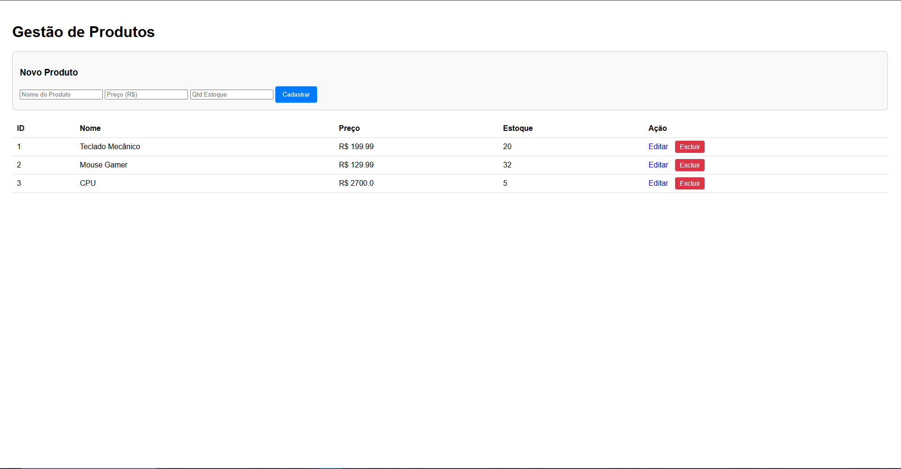
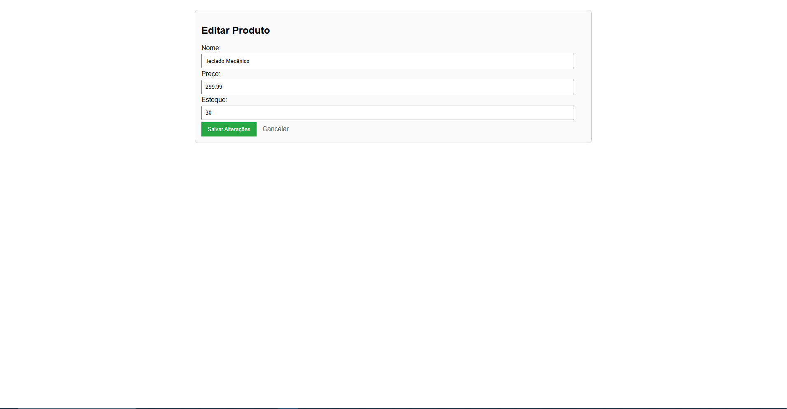
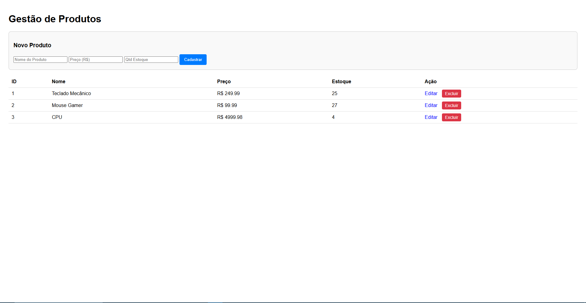

# 📦 Sistema de Gestão de Produtos (CRUD Flask)

Este projeto é uma aplicação web desenvolvida em **Python** utilizando o framework **Flask**. O objetivo foi simular um cenário real de mercado, criando um sistema completo de gestão de estoque (CRUD) com foco em arquitetura limpa, segurança e boas práticas de desenvolvimento backend.


## 🎯 Objetivo do Projeto
Como desenvolvedor, meu foco com este projeto foi ir além do básico. Não queria apenas criar e deletar dados, mas sim entender **como estruturar uma aplicação escalável**. 

Por isso, abandonei a prática comum de "tudo em um arquivo só" e implementei uma **Arquitetura MVC (Model-View-Controller)** modular, garantindo que o Frontend nunca converse diretamente com o Banco de Dados, mas sim através de rotas controladas e seguras.

## 🛠️ Tecnologias Utilizadas

* **Backend:** Python 3, Flask.
* **Banco de Dados:** SQLite (com SQLAlchemy ORM).
* **Frontend:** HTML5, CSS3, Jinja2 (Template Engine).
* **Gerenciamento de Ambiente:** Python-dotenv (para segurança de dados sensíveis).

## 🚀 Funcionalidades

O sistema permite o gerenciamento completo do ciclo de vida de um produto:
* ✅ **Create:** Cadastro de produtos com validação de dados.
* ✅ **Read:** Listagem dinâmica dos produtos salvos no banco.
* ✅ **Update:** Edição de informações (Nome, Preço, Estoque).
* ✅ **Delete:** Remoção segura de itens do banco de dados.

## 🏗️ Estrutura e Arquitetura

O projeto segue o padrão **MVC** adaptado para Flask (Blueprints):

```text
projeto_loja/
├── app/
│   ├── models.py      # Camada de Dados (Tabelas SQL)
│   ├── routes.py      # Camada de Controle (Lógica Backend)
│   └── templates/     # Camada de Visualização (HTML/Frontend)
├── config.py          # Centralização de Configurações
├── .env               # Variáveis de Ambiente (Segurança)
└── run.py             # Ponto de entrada da aplicação
```
## 📸 Screenshots

Aqui está o fluxo completo de funcionamento do sistema:

### 1. Tela Inicial (Listagem)
Visão geral do sistema com produtos cadastrados, mostrando a leitura dinâmica do banco de dados (Read).


### 2. Tela de Edição
Formulário preenchido automaticamente com os dados atuais do produto, pronto para alteração (Update).


### 3. Resultado da Edição
A mesma lista inicial, agora refletindo as alterações de preços e quantidades salvas no banco.

